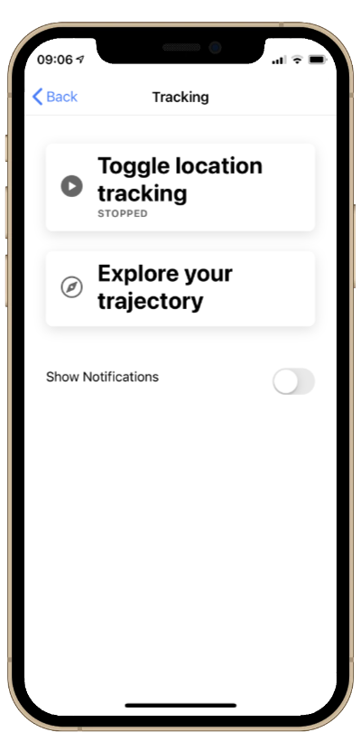
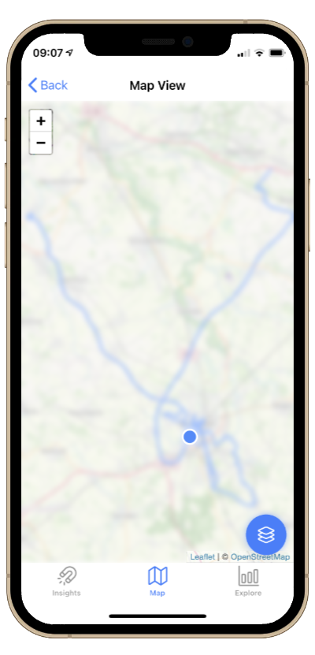

# SIMPORT Learning App &middot; <a href="https://github.com/sitcomlab/simport-learning-app/actions/workflows/build-android.yml"></a> <a href="https://github.com/sitcomlab/simport-learning-app/actions/workflows/build-ios.yml"></a> <a href="https://github.com/sitcomlab/simport-learning-app/actions/workflows/run-tests.yml"></a>

</br>

[](https://simport.net/)

---

Learning tool on location data privacy, that reflects to users, what conclusions can be drawn from their location histories. It is used to record location data over a timespan and analyzing that locally to create inferences - e.g. about where the user might work or live. The app works completely autonomously and doesn't need any internet connection whatsoever. This is part of the [SIMPORT][simport] project.

> **Status**: prototyping 🛠️

## Contents

- ### [App Usage](#app-usage)
- ### [Development](#development)
  - [Setup](#setup)
    - [Quickstart](#quickstart-tools)
    - [Android](#android)
    - [iOS](#ios)
  - [Build and Run](#build-and-run)
  - [Version Control](#version-control)
  - [Inferences](#inferences)
  - [Test](#test)
- ### [License](#license)

## App Usage

It is intended that one records her/his location data of the course of multiple days/weeks/months using this app. By collecting and analyzing the recorded location history (locally), it is tried to infer information about the user - such as her/his home and work location. Users should be notified, if such inferences can be made in order to reflect to them, what conclusions can be drawn using their location histories.
Furthermore recorded trajectories can be exported, external trajectories can be imported and examined using the app as well.

<p align="center">
  
</p>

## Development

This is an hybrid [Ionic][ionic] app, using [Capacitator][capacitor] (a drop-in replacement
for Cordova) to access native APIs and [Angular][angular] for UI.

### Setup

#### Quickstart (Tools)

- [git][git]
- [node.js][node] (version 16.14)
- [Ionic CLI][ionic-cli]
- [Visual Studio Code][vscode] with [prettier][vscode-prettier]
- [Android Studio][androidstudio] / [XCode][xcode]

---

For basic UI development you need [node.js][node] (version 16.14) installed - further information can be found [here](https://nodejs.org/de/download/package-manager/).
As an IDE you can basically choose by your own taste. Our recommendation is to use [Visual Studio Code][vscode] with the code formatter [Prettier][vscode-prettier] using [these settings](.prettierrc.json). This guarantees consistent and uniform code.

##### Clone the repository

```sh
git clone git@github.com:sitcomlab/simport-learning-app
```

##### Within the repository, install the [ionic CLI](ionic-cli), which is used for most management tasks, as well as the frontend dependencies

```sh
cd simport-learning-app
npm install -g @ionic/cli # install the ionic CLI
npm install               # install the frontend dependencies
```

#### Android

- Install the latest version of [Android Studio][androidstudio]
  - on Linux, install to `/opt/android-studio/`, as this path is configured in `capacitor.config.json`
- Download an up-to-date Android SDK (e.g. SDK 29)
  - Within Android Studio: `Tools` → `SDK Manager`)
- Optional: Setup emulators as needed for testing the app on a computer
  - Within Android Studio: `Tools` → `AVD Manager`)
- Make sure to run `Sync Project with Gradle Files` before building when dependencies have changed
- Built artifact will be `./android/app/build/outputs/apk/app-debug.apk`

#### iOS

> 📝 This only works on macOS.

- Install the latest version of [XCode][xcode]
- Optional: Setup emulators as needed for testing the app on a computer
  - Within XCode: `Window` → `Devices and Simulators` → `Simulators`)
- For running on physical devices, XCode requires that you’ve connected a Team to the project → [more information here](https://developer.apple.com/documentation/xcode/running-your-app-in-the-simulator-or-on-a-device)
- Make sure to run `pod install` in your terminal before building when dependencies have changed

> 📝 With [Capacitor][capacitor], the native build projects are supposed to be checked into version control.
> This avoids duplicate config and simplifies writing native code without creating plugins.

### Build and Run

##### Hot Reloading Server (→ [see here](https://ionicframework.com/docs/cli/commands/serve))

```sh
ionic serve
```

##### Build frontend to ./www/ (→ [see here](https://ionicframework.com/docs/cli/commands/build))

```sh
ionic build
```

##### Prepare app builds & open IDE (→ [see here](https://ionicframework.com/docs/cli/commands/capacitor-build))

###### Android

```sh
ionic cap update
ionic cap build android
```

###### iOS

```sh
ionic cap update
ionic cap build ios
```

##### Sync app builds (→ [see here](https://ionicframework.com/docs/cli/commands/capacitor-sync))

###### Android

```sh
ionic cap sync android
```

###### iOS

```sh
ionic cap sync ios
```

### Version Control

Using Github this project is obviously versioned using [git][git]. The branch `develop` is used as the main branch, while actual developing of new features is done on individual feature branches. These features branches are using the following naming scheme:

```
feature/<feature name>
```

When finished (including review) developing a feature, the feature branches are merged `develop`. For your commits, please use the following commit message if applicable:

```
#<issue number>: <commit message>
```

Releases are automatically triggered on push to `release-beta` using [GitHub Actions](.github/workflows) and distributed to a closed group of beta-testers using [Firebase][firebase].

### Inferences

A core-component of this learning app is the inference-algorithm. By analyzing the recorded location history, it is tried to infer information about the user with this algorightm - information such as her/his home and work location. The corresponding procedure on how to process user-trajectories in order to generate those inferences is explained with a brief flow-diagram. Furthermore a light class-diagramm that focuses on the inference-components gives an overview how the parts are connected and come together.

- <a href="documents/inferences_procedure.pdf" class="image fit">📄 Chart: procedure of generating inferences</a>
- <a href="documents/inferences_class_diagram.pdf" class="image fit">📄 Diagram: inferences-compononents</a>

### Test

Apart from basic component testing (default Angular), the testing framework is used to validate the inference algorithms.
By running the tests via `npm run test` a few simple trajectories are generated, that are designed to cover some border cases - e.g. variation in location frequency and accuracy. The creation of this test data is based on a few location files [located here](dev/test-data-gpx). The generated test data is based upon the following location pattern, which result from the assumptions of a typical work day (9 to 5).

| Activity      |    Start datetime    |     End datetime     |
| ------------- | :------------------: | :------------------: |
| Dwell at home | 2021-02-23T18:00:00Z | 2021-02-24T08:45:00Z |
| Ride to work  | 2021-02-24T08:45:00Z | 2021-02-24T09:00:00Z |
| Dwell at work | 2021-02-24T09:00:00Z | 2021-02-24T17:00:00Z |
| Ride home     | 2021-02-24T17:00:00Z | 2021-02-24T17:15:00Z |
| Dwell at home | 2021-02-24T17:15:00Z | 2021-02-25T08:45:00Z |

Currently the following test cases are created, analyzed and checked against the given expected inferences:

|           Trajectory            | Description                                                                                                                                                                                                   | Expected inferences |
| :-----------------------------: | ------------------------------------------------------------------------------------------------------------------------------------------------------------------------------------------------------------- | :-----------------: |
|              Empty              | Empty trajectory, contains no locations.                                                                                                                                                                      |        None         |
|           Mobile only           | Trajectory, that only contains mobile data. Therefore it contains only the ride to and from work, but no stationary location for dwelling at home or work.                                                    |        None         |
|      Simple home and work       | Simple trajectory that simulates a usual day of work. The location data contains the assumed movement data stated above with typical point clouds at the dwelling locations. Without any special constraints. |      Home/Work      |
|  Spatially dense home and work  | Similar to simple home/work, but stationary data (point clouds for dwelling time) is way more spatially dense, which simulates a lot of movement/higher update frequency during recording.                    |      Home/Work      |
| Temporally sparse home and work | Similar to simple home/work, but stationary data (point clouds for dwelling time) is way more temporally sparse, which simulates a less movement/lower update frequency during recording.                     |      Home/Work      |

These tests are automatically executed when pushing to the development branch. The last test-result can be seen at the top of this page.

## License

```
SIMPORT Learning App
Copyright (c) 2022 Sitcom Lab
```

[Further information](LICENSE)

[simport]: https://simport.net/
[ionic]: https://ionicframework.com/
[ionic-cli]: https://ionicframework.com/docs/cli
[capacitor]: https://capacitorjs.com/
[angular]: https://angular.io/
[firebase]: https://firebase.google.com
[node]: https://nodejs.org/
[vscode]: https://code.visualstudio.com
[vscode-prettier]: https://marketplace.visualstudio.com/items?itemName=esbenp.prettier-vscode
[xcode]: https://developer.apple.com/xcode/
[androidstudio]: https://developer.android.com/studio/install
[git]: https://git-scm.com
